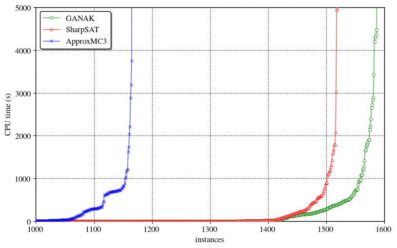

+++
title = "GANAK: A Scalable Probabilistic Exact Model Counter"
date = 2019-04-03T11:06:17+05:30
draft = false

# Authors. Comma separated list, e.g. `["Bob Smith", "David Jones"]`.
authors = ["Shubham Sharma"]

# Tags and categories
# For example, use `tags = []` for no tags, or the form `tags = ["A Tag", "Another Tag"]` for one or more tags.
tags = []
categories = []

# Featured image
# Place your image in the `static/img/` folder and reference its filename below, e.g. `image = "example.jpg"`.
# Use `caption` to display an image caption.
#   Markdown linking is allowed, e.g. `caption = "[Image credit](http://example.org)"`.
# Set `preview` to `false` to disable the thumbnail in listings.
[header]
image = ""
caption = ""
preview = true

+++
This blogpost talks about our tool [GANAK](https://github.com/meelgroup/ganak) that inherits current advancements in SAT solving and model counting, improves upon them and contributes new ideas, thereby outperforming state-of-the-art model counters. The source code of GANAK is available [here](https://github.com/meelgroup/ganak) and the paper is available [here](https://www.comp.nus.edu.sg/~meel/Papers/ijcai19srsm.pdf). The main result is that we can solve a lot more problems than before: 

Let's first define Model Counting.
<h3>Model Counting</h3>
***
Given a Boolean formula $F$, over a set of variable $X$, model counting (aka \#SAT) seeks to compute the number of solutions of $F$. In 1979 Valiant showed that \#SAT is \#P-complete problem and in 1989 Toda proved that every problem in the polynomial hierarchy could be solved by just one call to a \#P oracle. Following types of model counting has been studied in the literature:

<h4>Exact Model Counting</h4>
Given $F$, the problem of exact model counting is to compute the number of solutions of $F$.
<h4> Probabilistic Exact Model Counting </h4>
Given $F$ and $\delta \in (0,1]$, probabilistic exact model counting estimates $\texttt{count}$ and guarantees that: $\mathsf{Pr}\big[|Solutions(F)| = \texttt{count}\big]\geq 1-\delta$. A recent study of different relaxations of model counting shows that probabilistic exact model counting is almost as hard as exact model counting

Let's see some of the applications of model counting
<h3> Applications of Model Counting </h3>
***
Model counting is a fundamental problem with a wide variety of applications ranging from machine learning, quantified information flow, network reliability, planning, probabilistic reasoning, and many other related fields. For example, given a graph $G$ such that each of its edges fails with some probability and two nodes, $s$ and $t$, the problem of computing probability of existence of a path from $s$ to $t$ can be reduced to that of propositional model counting.

Let's talk about GANAK
<h3> GANAK </h3>
***
GANAK is a scalable probabilistic exact model counter that inherits the strength of a state-of-the-art exact model counter, sharpSAT, and is equipped with the following new algorithmic advances

* Probabilistic component caching (PCC)
* New variable branching heuristic (CSVSADS)
* New phase selection heuristic (PC)
* Independent support heuristic (IS)
* Exponentially decaying randomness heuristic (EDR)
* Learn and start over heuristic (LSO)

Detailed discussion about each of these heuristic can be found [here](https://www.comp.nus.edu.sg/~meel/Papers/ijcai19srsm.pdf)

<h3> Results </h3>
***

We evaluate the runtime performance of GANAK on $2031$ publicly available benchmarks arising from a wide range of applications of model counting. Our experiments demonstrate that GANAK performs best when all the heuristics describe in the previous section (except EDR) are enabled. GANAK outperforms state-of-the-art exact model counter, both in terms of PAR-2 score and the number of instances solved. Finally, in our experiments, the model count returned by GANAK was equal to the exact model count for all the benchmarks.

We are thankful to the [National Supercomputing Center Singapore](https://www.nscc.sg/) for providing us computational resources to run our experiments.