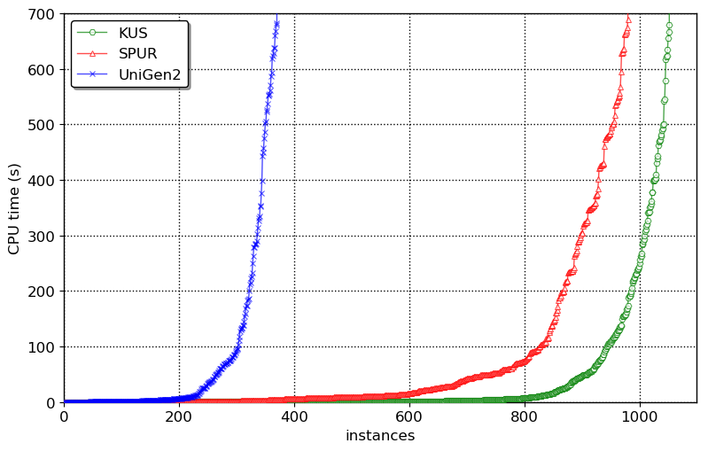
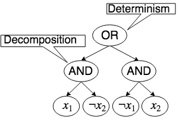

+++
title = "Knowledge Compilation meets Uniform Sampling"
date = 2019-05-03T11:06:17+05:30
draft = false

# Authors. Comma separated list, e.g. `["Bob Smith", "David Jones"]`.
authors = ["Shubham Sharma"]

# Tags and categories
# For example, use `tags = []` for no tags, or the form `tags = ["A Tag", "Another Tag"]` for one or more tags.
tags = []
categories = []

# Featured image
# Place your image in the `static/img/` folder and reference its filename below, e.g. `image = "example.jpg"`.
# Use `caption` to display an image caption.
#   Markdown linking is allowed, e.g. `caption = "[Image credit](http://example.org)"`.
# Set `preview` to `false` to disable the thumbnail in listings.
[header]
image = ""
caption = ""
preview = true

+++
This blogpost is based on our [paper](https://www.comp.nus.edu.sg/~meel/Papers/lpar18.pdf) that got published in the procedings of International Conference on Logic for Programming, Artificial Intelligence and Reasoning (LPAR), 2018. The code is available [here](https://github.com/meelgroup/KUS). The primary contribution of this work is marrying knowledge compilation with uniform sampling to design a new uniform sampler KUS. The main result is that KUS is able to solve more number of benchmarks than existing state-of-the-art uniform and almost-uniform samplers beating them by orders of magnitude in terms of runtime:

<h3>Uniform Sampling</h3>
***
Given a boolean formula $F$, the idea of Uniform Sampling is to generate samples from the set of solutions of $F$ called $R_F$ using a generator $\mathcal{G}$ that guarantees:
$$\forall y \in R_F, \mathsf{Pr}\left[\mathcal{G}(F) = y\right] = \frac{1}{|R_F|},$$
Uniform sampling is a fundamental problem in computer science with wide range of applications ranging from bayesian analysis to software engineering and programming languages. Jerrum, Valiant, and Vazirani observed deep relationship between model counting and uniform sampling. In particular, they showed that given access to an exact model counter, one could design a uniform generator which requires only polynomially many queries to the exact model counter. On the other hand, knowledge compilation has been emerged as a vital task wherein a logical theory is compiled into a form that allows performing probabilistic inference in polynomial time. It is well known that there is a deep connection between probabilistic inference and model counting. In this context, one wonders if the recent advances in knowledge compilation can be harnessed to design a scalable uniform sampler. The primary contribution of this work is marrying knowledge compilation with uniform sampling to design a new algorithm, KUS, that performs uniform sampling, outperforming current state-of-the-art approximately uniform and uniform samplers.

<h3> Knowledge Compilation and d-DNNF representation</h3>
***
To deal with computational intractability of probabilistic reasoning, knowledge compilation seeks to compile a knowledge base, often represented as a propositional formula in CNF, to a target language. Thereafter, probabilistic reasoning tasks, which are often expressed as sequence of queries, are performed by querying the knowledge base in the target language. Deterministic Decomposable Negation Normal Form (d-DNNF) have emerged as a central target language in knowledge compilation community since several probabilistic reasoning tasks such as probabilistic inference, maximum a posteriori (MAP) can be answered in polynomial time in the size of d-DNNF. A boolean formula in Negation Normal Form (NNF) is said to be in d-DNNF if it satisfes the following properties:
<ul>
<li> Deterministic: We refer to an NNF as deterministic if the operands of OR in all wellformed Boolean formula in the NNF are mutually inconsistent.</li>
<li>Decomposable: We refer to an NNF as decomposable if the operands of AND in all wellformed Boolean formula in the NNF are expressed in a mutually disjoint set of variables.</li>
</ul>

d-DNNF of a boolean formula $F$ represent the set of satisfying assignment $R_F$
<h3>The algorithm</h3>
***
The central idea behind KUS is to first employ the state-of-the-art knowledge compilation approaches to compile a given CNF formula into d-DNNF form, and then performing only two passes over the d-DNNF representation to generate as many identically and independently distributed samples as specified by the user denoted by $s$.

KUS takes in a CNF formula $F$ and required number of samples s and returns a set of $s$ samples such that each sample is uniformly and independently drawn from the uniform distribution over the set of solutions $R_F$. KUS first invokes a d-DNNF compiler over the formula F to obtain its d-DNNF. Then, the subroutine Annotate is invoked that annotates d-DNNF by annotating each node with a tuple consisting of the number of solutions and the set of variables in the node's corresponding sub-formula. Then, the subroutine Sampler is invoked that returns s uniformly and independently drawn samples using the properties of d-DNNF. Finally, KUS gives random assignment to the unassigned variables for each sample in the SampleList to account for unconstrained variables that do not appear in d-DNNF by invoking the subroutine RandomAssignment.
<h3>The Results</h3>
Our experiments demonstrated that KUS outperformed both SPUR and UniGen2 state-of-the-art uniform and almost-uniform samplers by a factor of up to $3$ orders of magnitude in terms of runtime in some cases while achieving a geometric speedup of $1.7\times$ and $8.3\times$ over SPUR and UniGen2 respectively. The distribution generated by KUS is statistically indistinguishable from that generated by an ideal uniform sampler. Moreover, KUS is almost oblivious to the number of samples requested. Finally, we observe that KUS can benefit from different d-DNNF compilers, therefore suggesting development of portfolio samplers in future. One of the biggest advantage of KUS is in incremental sampling--fetching multiple, relatively small-sized samples, repeatedly. The typical use case of iterative sampling can be in repeated invocation of a sampling tool until the objective (such as desired coverage or violation of property) is achieved. In incremental-sampling KUS achieves speedups of upto 3 orders of magnitude.
<h3>Conclusion</h3>
***
<ul>
<li>In this work, we have proposed a new approach for uniform sampling that builds on breakthrough progress in knowledge compilation</li>
<li>Experimentally we have demonstrated that KUS outperformed state-of-the-art uniform and almost-uniform samplers</li>
<li>We believe that the success of KUS will motivate researchers in verification and knowledge compilation communities to investigate a broader set of logical forms amenable to efficient uniform generation</li>
</ul>