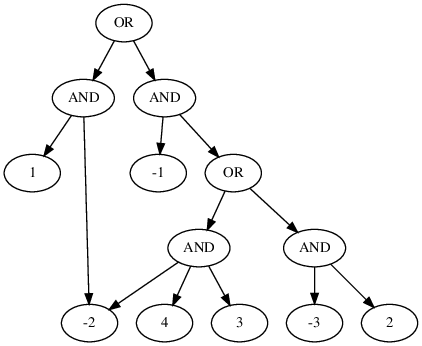
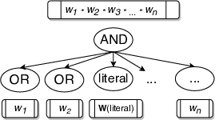

+++
title = "WAPS: Weighted and Projected Sampling"
date = 2019-05-03T11:06:17+05:30
draft = false

# Authors. Comma separated list, e.g. `["Bob Smith", "David Jones"]`.
authors = ["Rahul Gupta"]

# Tags and categories
# For example, use `tags = []` for no tags, or the form `tags = ["A Tag", "Another Tag"]` for one or more tags.
tags = []
categories = []

# Featured image
# Place your image in the `static/img/` folder and reference its filename below, e.g. `image = "example.jpg"`.
# Use `caption` to display an image caption.
#   Markdown linking is allowed, e.g. `caption = "[Image credit](http://example.org)"`.
# Set `preview` to `false` to disable the thumbnail in listings.
[header]
image = ""
caption = ""
preview = true

+++
This blogpost talks about our tool [WAPS](https://github.com/meelgroup/WAPS). Specifically, we will talk about how we are able to utilize the idea of sampling using knowledge compilations (d-DNNFs) from our previous work ([KUS](https://www.comp.nus.edu.sg/~meel/Papers/lpar18.pdf)) and generalize it in order to achieve weighted and projected sampling. This work was jointly performed by [Rahul](https://rahulguptakota.github.io/) and [Shubham](https://smsharma1.github.io/) in the mentorship of [Subhajit](https://www.cse.iitk.ac.in/users/subhajit/) and [Kuldeep](https://www.comp.nus.edu.sg/~meel/). You can read the paper [here](https://www.comp.nus.edu.sg/~meel/Papers/tacas19.pdf) and get the tool [here](https://github.com/meelgroup/WAPS). You can read the previous [blog](https://meelgroup.github.io/post/kus/) that describes uniform sampling using knowledge compilations, though it is not absolutely necessary for this post.
<!-- Don't worry if you haven't read the previous blog, I am going to mention the required details here.  -->

Let's talk about what it means to achieve weighted sampling at first.
<h3>Weighted Sampling</h3>
***
Given a formula $F$ and a weight function $W$, the objective of $weighted$ sampling is to draw samples from the set of satisfying assignments of $F$ called $R\_{F}$ using a generator $\mathcal{G}^{w}(F, W)$ that ensures
 $$\forall y \in R_{F}, \mathsf{Pr}\left[\mathcal{G}^{w}(F, W) = y\right] = \frac{W(y)}{W(R\_F)}$$

<!-- So, we are trying to construct a weighted probabilistic generator. -->
Intuitively, this just means that the probability of drawing a sample is proportional to its weight. In our case, we are dealing with literal-weighted weight function and the weight of an assignment is simply given by the product of weight of individual literals in the assignment. Broadly speaking, WAPS proceeds in three stages:

* d-DNNF compilation
* Annotation 
* Sampling. 

Let's look at what a typical d-DNNF looks like:

d-DNNF (Deterministic Decomposable Negation Normal Form) can be seen as a compact representation of the satisfying assignments for a given formula. One can also view it as the search space of component decomposition based DPLL procedures popularly employed in SAT solving and model counting. This perspective is helpful for Projected Sampling as you will see. Essentially, in a d-DNNF, the formulae given by children of OR nodes have different (inconsistent to be precise) satisfying assignments (determinism); so, you can choose one of the children if you were to sample a satisfying assignment. On the other hand, the children of AND nodes are drawn over mutually disjoint sets of variables (decomposability);thus allowing you to simply stitch samples drawn from different children to get an overall sample.

WAPS proceeds by first compiling the given CNF formula into its d-DNNF. This is followed by Annotation. The central idea in WAPS is to annotate the compiled d-DNNF in a way which allows weighted sampling by simply performing weighted bernoulli trials over d-DNNF in the Sampling phase (Refer to our [paper](https://www.comp.nus.edu.sg/~meel/Papers/tacas19.pdf) for more details).
The weight annotation is summarised by the figures below:

  

    
  

  

    
  

In our paper, we show that this annotation scheme allows you to perform weighted sampling.

<h3> Weighted and Projected Sampling </h3>
***
Given a formula $F$, a set of projecting variables $P$ and a weight function $W$, the objective of $weighted~and~projected$ sampling is to draw samples from the set of satisfying assignments of $F$ projected over $P$ called $R_{F\downarrow P}$ using a generator $\mathcal{G}^{wp}(F, P, W)$ that ensures
$$\forall y \in R\_{F\downarrow P}, \mathsf{Pr}\left[\mathcal{G}^{wp}(F, P, W) = y\right] = \frac{W(y)}{W(R\_{F\downarrow P})}$$
Intuitively, this means that samples drawn contain only a subset of variables ($P$) as opposed to all variables in the formula and these samples obey the weight distribution given by $W$ over the variables appearing in samples. This has applications in hardware verification and other places where encoding original problem into CNF generates additional Tseitin variables while weight distribution is only defined on original variables in the problem. In such cases, we are often interested in samples from variables of the original problem. 

<h4>Projected Sampling </h4>
To achieve Projected Sampling, we aim to produce a d-DNNF which represents the set of satisfying assignments projected over a given set of projecting variables. To accomplish this, we modified Dsharp, a state of the art d-DNNF compiler to search first on projecting variables and then simply check if the residual formula is satisfiable to retain the corresponding path in d-DNNF. Notably, this technique has been used in the context of Projected Model Counting and Quantitative Information Flow before. 

The above technique combined with weighted sampling sums up the buildup of WAPS (Weighted and Projected Sampler).

<h4> Incremental Sampling </h4>
Another interesting property as a side-effect of knowledge compilation based sampling is that incremental sampling (i.e. fetching multiple relatively short sized samples) can be performed efficiently. This is simply done by saving the compiled d-DNNF or its annotated version depending upon whether weights change in different iterations.

<h3> Results </h3>
***
Our experiments demonstrate that WAPS is able to significantly outperform existing state-of-the-art weighted and projected sampler WeightGen, by up to $3$ orders of magnitude in terms of runtime while
achieving a geometric speedup of $296\times$. For $incremental~sampling$ i.e. fetching multiple, relatively small-sized samples, repeatedly, WAPS achieves a geometric speedup of $3.69$. Also, WAPS is almost oblivious to the number of samples requested. Empirically, the distribution generated by WAPS is statistically indistinguishable from that generated by an ideal weighted and projected sampler.  Also, while performing conditioned sampling in WAPS, we incur no extra cost in terms of runtime in most of the cases. Moreover, the performance of our knowledge compilation based sampling technique is found to be oblivious to weight distribution. Detailed data is available at [here](https://github.com/meelgroup/waps).

<h3> Final Thoughts </h3>
***
This work has further tapped into the potential of sampling using knowledge compilations by developing procedures that allow weighted and projected sampling. We believe that the general idea of annotating knowledge compilations in different ways has even greater potential for sampling suited to a wider set of applications. Further work can also explore the development of faster sampling methods which leverage partially compiled d-DNNFs. Moreover, comparing the performance as well as functional capabilities with regard to sampling in different knowledge compilations such as SDDs(Sequential Decision Diagrams) is an interesting direction.
